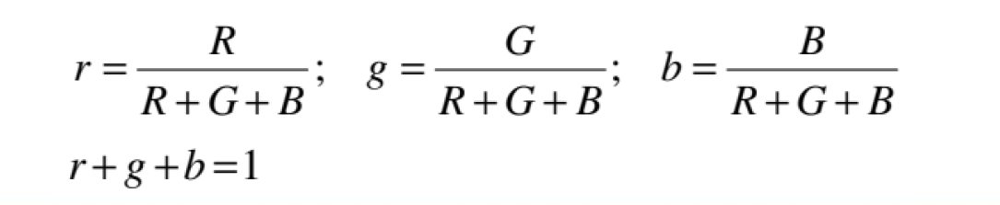
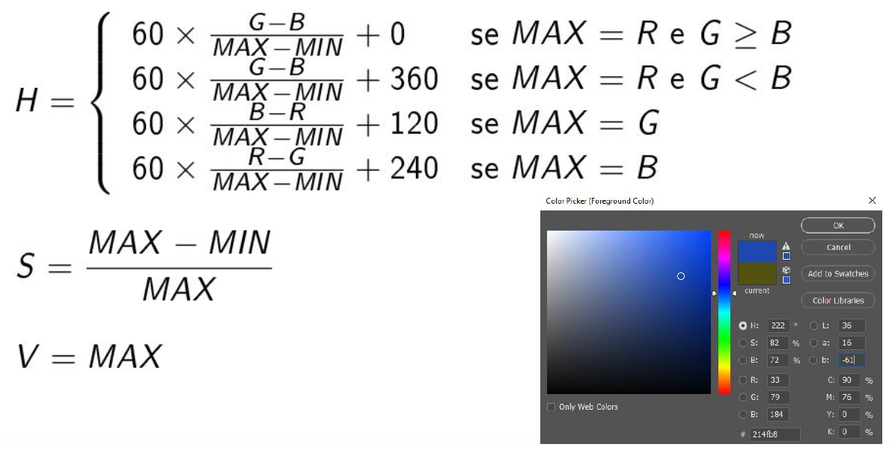
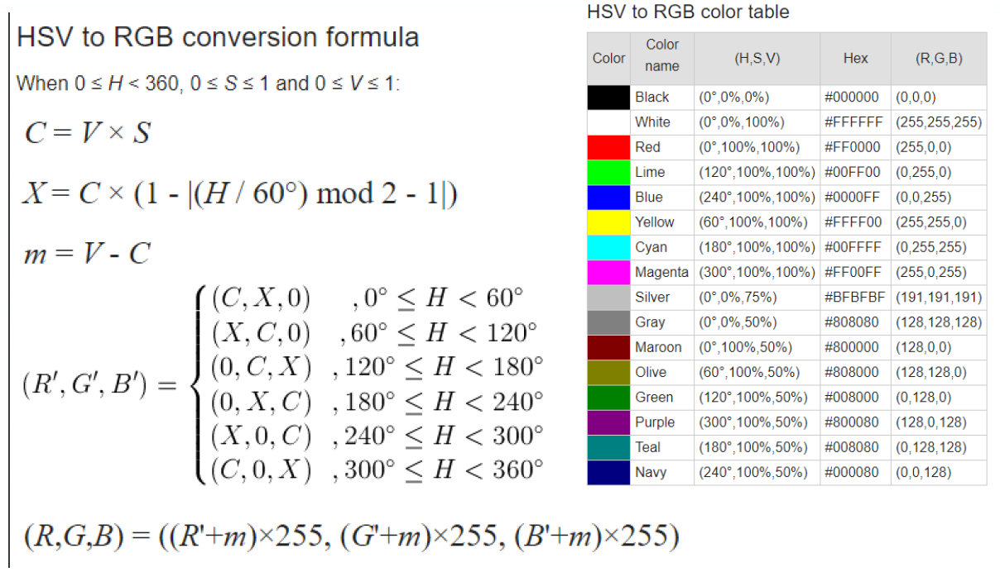
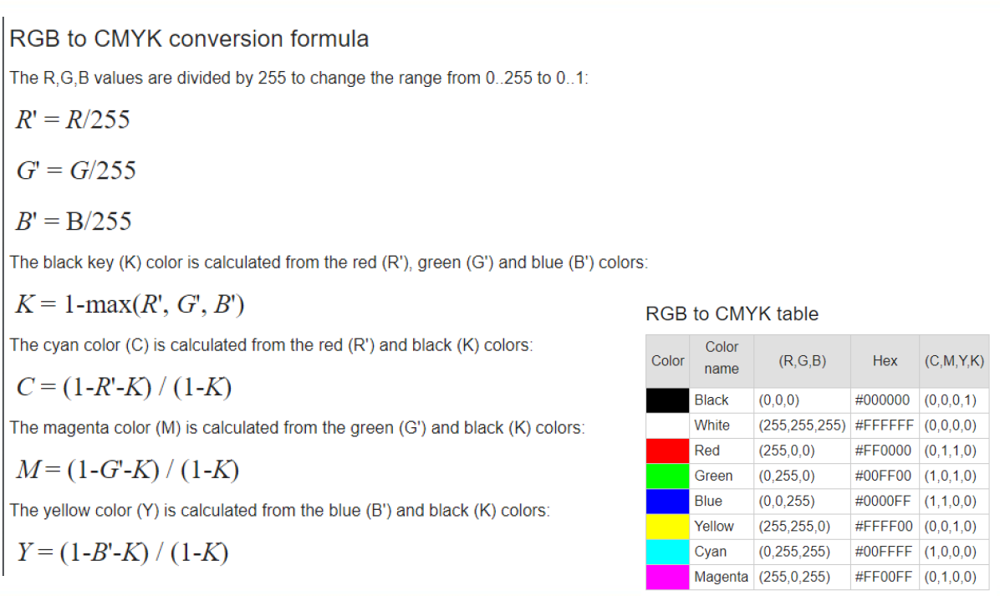
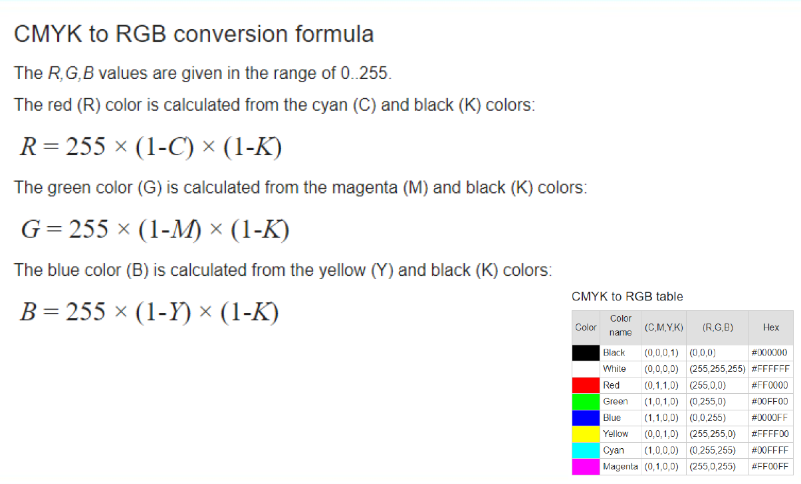

# furi-colorPicker

##### This is an academic project, developed for the Image Processing subject at URI Erechim College (FURI).

Its purpose is to perform conversions between different color systems: 

- Normalize an RGB value.
- Convert an RGB value to HSV.
- Convert an HSV value to RGB.
- Convert an RGB value to CMYK.
- Convert CMYK to RGB.
- Convert an RGB value to Grayscale.

### Instructions:

- To run the project as a whole, it is necessary to open the file `index.html` in the browser **or** access the address [Color Picker - FURI](https://igorfollador.github.io/furi-colorPicker/) hosted by service GitHub Pages;

#### INFO:

- Equation to normalize RGB:

  

- Equation to convert RGB to HSV:

  

- Equation to convert HSV to RGB:

  

- Equation to convert HSV to RGB:

- Equation to convert HSV to RGB:

